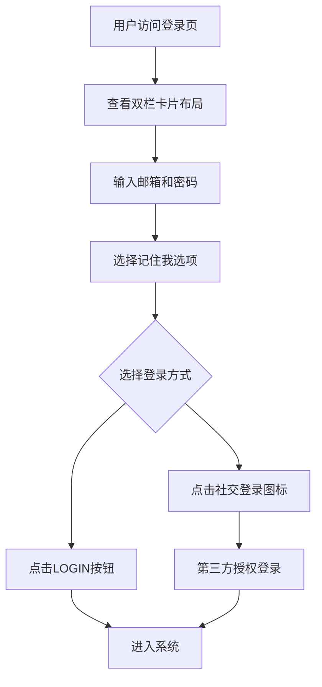

## 1. 产品概述
本项目旨在优化现有登录界面，将简单的登录表单升级为现代化的双栏卡片式设计。通过引入圆角化风格、蓝色渐变背景和插画元素，提升用户登录体验，打造专业且具有视觉吸引力的登录界面。

## 2. 核心功能

### 2.1 页面模块
登录界面包含以下核心模块：
1. **双栏布局容器**：左侧插画面板，右侧表单面板
2. **背景系统**：蓝色渐变背景配合波浪形状装饰
3. **表单区域**：包含标题、输入框、选项和按钮
4. **社交登录**：集成第三方登录选项

### 2.2 页面详情
| 页面名称 | 模块名称 | 功能描述 |
|---------|---------|---------|
| 登录页面 | 双栏卡片容器 | 创建24-28px圆角的双栏卡片布局，左侧为插画区域，右侧为表单区域，整体悬浮在蓝色渐变背景上 |
| 登录页面 | 背景装饰 | 实现蓝色渐变背景（#2F76F6到#1E2A78），添加柔和的波浪形状作为装饰元素 |
| 登录页面 | 左侧插画面板 | 浅蓝色背景面板，展示"welcome"文字（小写脚本字体，深蓝色），文字放置在粉色丝带上，由两个角色形象手持 |
| 登录页面 | 表单标题区域 | 显示"Login"主标题（加粗无衬线字体，深蓝色#1E2A78，左对齐大字号）和"Please login to continue"副标题（常规无衬线，中灰色#8A90A0，左对齐） |
| 登录页面 | 邮箱输入框 | 圆角输入框（浅灰色背景#E5E8F0，细边框），支持预填充邮箱地址，全宽显示，文本左对齐，中灰色字体 |
| 登录页面 | 密码输入框 | 与邮箱输入框样式一致，占位符显示"Password"，浅灰色占位符文字 |
| 登录页面 | 登录选项行 | 包含"记住我"复选框（蓝色勾选状态，中灰色文字）和"忘记密码？"链接（中蓝色，右对齐） |
| 登录页面 | 登录按钮 | 全宽圆角按钮，中等蓝色填充（#2F76F6），白色大写文字"LOGIN"，居中显示 |
| 登录页面 | 分隔区域 | 显示"Or"和"Login With"文字，浅灰色，居中显示，小字号 |
| 登录页面 | 社交登录按钮 | 三个圆形图标按钮：Facebook（深蓝色背景，白色"f"）、Twitter（天蓝色背景，白色鸟形图标）、Google（浅灰色背景，多彩"G"），均匀分布，居中排列 |

## 3. 核心流程
用户访问登录页面的操作流程：
1. 用户进入登录页面，看到双栏卡片设计
2. 左侧插画区域展示欢迎信息，右侧显示登录表单
3. 用户输入邮箱地址和密码
4. 可选择"记住我"选项保持登录状态
5. 点击"忘记密码？"可找回密码
6. 点击"LOGIN"按钮提交登录信息
7. 或使用社交登录快速登录

## 4. 用户界面设计

### 4.1 设计风格
- **主色调**：深蓝色（#1E2A78）、中等蓝色（#2F76F6）
- **辅助色**：浅灰色（#E5E8F0）、中灰色（#8A90A0）、粉色（插画区域）
- **按钮样式**：全宽圆角按钮，实心填充，白色文字
- **字体**：无衬线字体，标题加粗，正文常规
- **布局风格**：双栏卡片式布局，左侧插画，右侧表单
- **圆角设计**：主要面板和控件均采用圆角（24-28px半径）

### 4.2 页面设计概述
| 页面名称 | 模块名称 | UI元素 |
|---------|---------|---------|
| 登录页面 | 整体布局 | 双栏卡片设计，24-28px大圆角，蓝色渐变背景带波浪装饰，左右分栏布局 |
| 登录页面 | 左侧插画 | 浅蓝色背景面板，"welcome"文字使用小写脚本字体，深蓝色，放置在粉色丝带上 |
| 登录页面 | 右侧表单 | 白色背景面板，垂直堆叠布局，包含标题、输入框、选项、按钮等元素 |
| 登录页面 | 输入框样式 | 圆角输入框，浅灰色背景，细边框，左对齐文本，中灰色字体 |
| 登录页面 | 按钮交互 | 登录按钮悬停效果，社交图标按钮点击反馈 |
| 登录页面 | 间距设计 | 卡片内使用充足内边距，表单元素间保持一致的垂直间距 |

### 4.3 响应式设计
- **桌面优先**：默认设计为桌面端，双栏布局
- **移动端适配**：在小屏幕设备上切换为单栏垂直布局
- **断点设置**：768px以下切换为移动端布局
- **触摸优化**：按钮和输入框增大点击区域，适配触摸操作