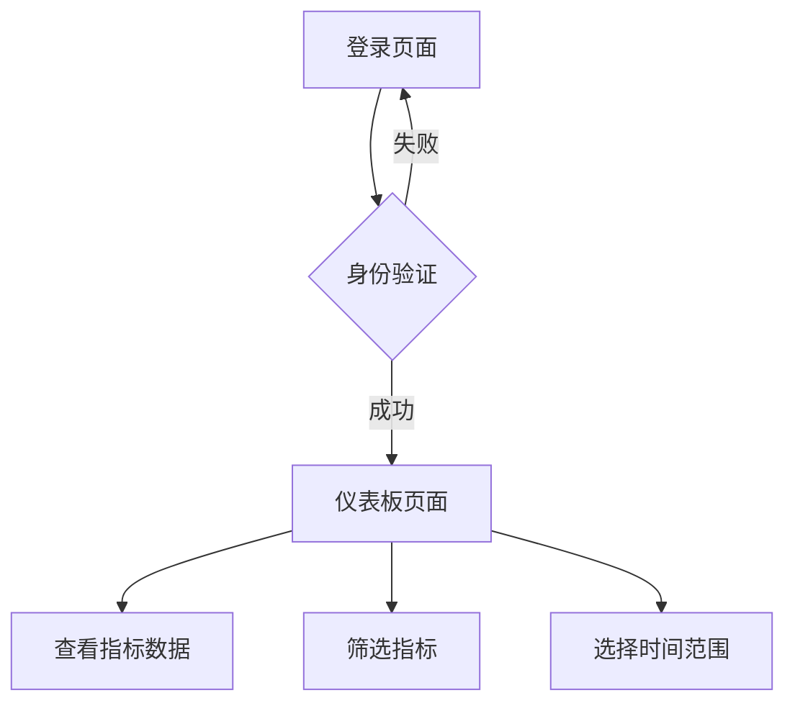

## 1. 产品概述
本项目是一个数据指标监控系统，用户可以通过身份验证后访问仪表板查看各类指标数据。系统旨在帮助用户实时监控和分析关键业务指标，提供直观的数据可视化界面。

## 2. 核心功能

### 2.1 用户角色
| 角色 | 注册方式 | 核心权限 |
|------|----------|----------|
| 普通用户 | 邮箱注册 | 登录系统、查看指标数据 |

### 2.2 功能模块
系统包含以下主要页面：
1. **登录页面**：用户身份验证、登录表单。
2. **仪表板页面**：指标数据展示、数据可视化、指标列表。

### 2.3 页面详情
| 页面名称 | 模块名称 | 功能描述 |
|-----------|-------------|---------------------|
| 登录页面 | 登录表单 | 输入用户名密码进行身份验证，支持记住登录状态 |
| 仪表板页面 | 指标概览 | 显示关键指标卡片，包括数值、趋势图表 |
| 仪表板页面 | 指标列表 | 展示所有可用指标的列表，支持筛选和搜索 |
| 仪表板页面 | 数据可视化 | 使用图表展示指标数据，支持时间范围选择 |

## 3. 核心流程
用户操作流程：
1. 用户访问登录页面，输入用户名密码进行身份验证
2. 验证成功后跳转到仪表板页面
3. 在仪表板页面查看各类指标数据和可视化图表
4. 用户可以筛选指标、选择时间范围查看数据

## 4. 用户界面设计

### 4.1 设计风格
- 主色调：蓝色系（#1890ff）
- 辅助色：灰色系（#f0f2f5）
- 按钮样式：圆角矩形，悬停效果
- 字体：系统默认字体，标题16px，正文14px
- 布局风格：卡片式布局，左侧导航
- 图标风格：线性图标，简洁现代

### 4.2 页面设计概览
| 页面名称 | 模块名称 | UI元素 |
|-----------|-------------|-------------|
| 登录页面 | 登录表单 | 居中卡片布局，蓝色主题，包含用户名密码输入框、登录按钮 |
| 仪表板页面 | 指标概览 | 网格布局的指标卡片，显示数值和趋势图，使用Element Plus组件 |
| 仪表板页面 | 指标列表 | 表格形式展示，支持排序和筛选，每行显示指标名称、数值、更新时间 |
| 仪表板页面 | 数据可视化 | 折线图展示数据趋势，支持时间选择器，响应式图表容器 |

### 4.3 响应式设计
采用桌面端优先的设计方案，适配不同屏幕尺寸：
- 桌面端：完整功能展示，多列布局
- 平板端：自适应布局，保持核心功能
- 移动端：单列布局，简化界面元素

### 4.4 交互优化
- 登录按钮加载状态显示
- 数据加载时的骨架屏效果
- 图表数据的平滑动画
- 错误提示的友好展示