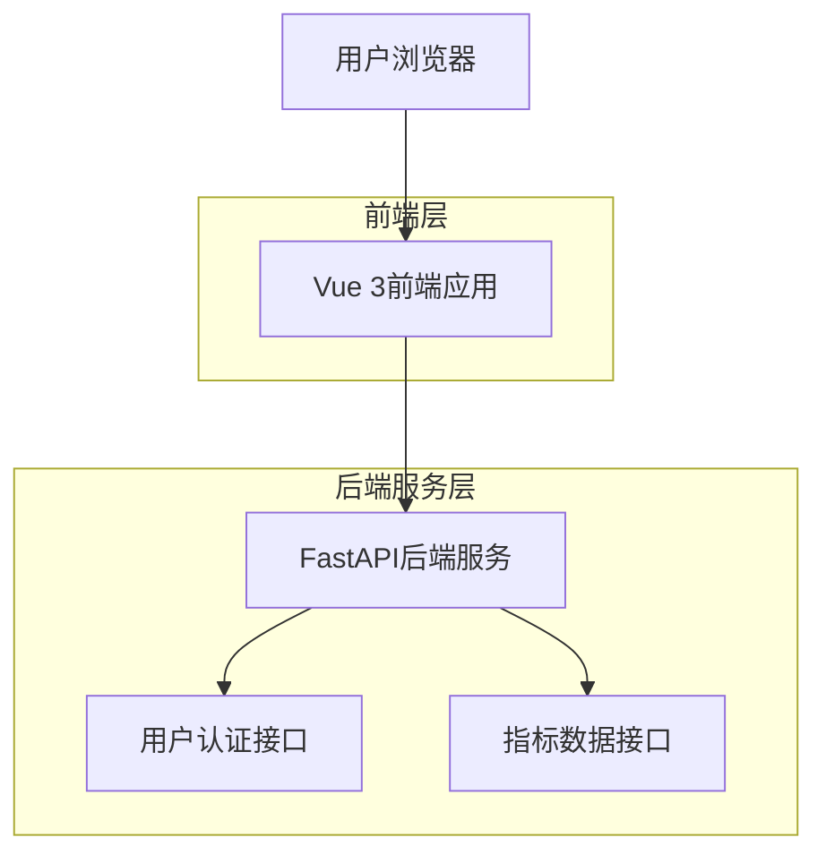
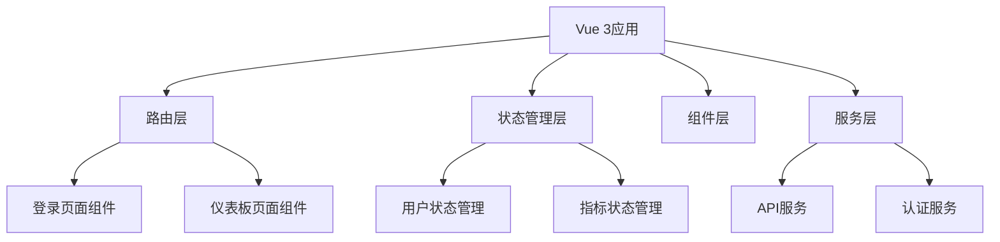

## 1. 架构设计



## 2. 技术栈描述

- 前端：Vue 3 + Vite + Element Plus + Pinia
- 初始化工具：vite-init
- 后端：FastAPI（已存在）
- 状态管理：Pinia
- UI组件库：Element Plus
- 构建工具：Vite

## 3. 路由定义

| 路由 | 用途 |
|-------|---------|
| /login | 登录页面，用户身份验证 |
| /dashboard | 仪表板页面，展示指标数据 |
| / | 重定向到登录页面或仪表板 |

## 4. API定义

### 4.1 认证相关API

用户登录
```
POST /api/auth/login
```

请求参数：
| 参数名 | 参数类型 | 是否必需 | 描述 |
|-----------|-------------|-------------|-------------|
| username | string | 是 | 用户名 |
| password | string | 是 | 密码 |

响应参数：
| 参数名 | 参数类型 | 描述 |
|-----------|-------------|-------------|
| access_token | string | JWT访问令牌 |
| token_type | string | 令牌类型 |
| user | object | 用户信息 |

### 4.2 指标相关API

获取指标列表
```
GET /api/indicators
```

请求头：
```
Authorization: Bearer {access_token}
```

响应参数：
| 参数名 | 参数类型 | 描述 |
|-----------|-------------|-------------|
| indicators | array | 指标数据数组 |
| total | number | 指标总数 |

获取单个指标详情
```
GET /api/indicators/{id}
```

请求头：
```
Authorization: Bearer {access_token}
```

响应参数：
| 参数名 | 参数类型 | 描述 |
|-----------|-------------|-------------|
| id | string | 指标ID |
| name | string | 指标名称 |
| value | number | 指标数值 |
| trend | array | 历史数据数组 |
| updated_at | string | 更新时间 |

## 5. 前端架构设计



## 6. 数据模型

### 6.1 前端数据模型定义

用户模型
```typescript
interface User {
  id: string
  username: string
  email: string
  created_at: string
}
```

指标模型
```typescript
interface Indicator {
  id: string
  name: string
  description: string
  value: number
  unit: string
  trend: TrendData[]
  updated_at: string
}

interface TrendData {
  timestamp: string
  value: number
}
```

### 6.2 状态管理结构

用户状态
```typescript
interface UserState {
  user: User | null
  token: string | null
  isAuthenticated: boolean
  loading: boolean
}
```

指标状态
```typescript
interface IndicatorState {
  indicators: Indicator[]
  currentIndicator: Indicator | null
  loading: boolean
  error: string | null
}
```

## 7. 组件设计

### 7.1 页面组件
- LoginPage.vue：登录页面，包含登录表单
- DashboardPage.vue：仪表板页面，展示指标数据

### 7.2 业务组件
- IndicatorCard.vue：指标卡片组件
- IndicatorChart.vue：指标图表组件
- IndicatorTable.vue：指标表格组件

### 7.3 基础组件
- AppHeader.vue：应用头部导航
- AppSidebar.vue：侧边栏导航
- LoadingSpinner.vue：加载动画组件